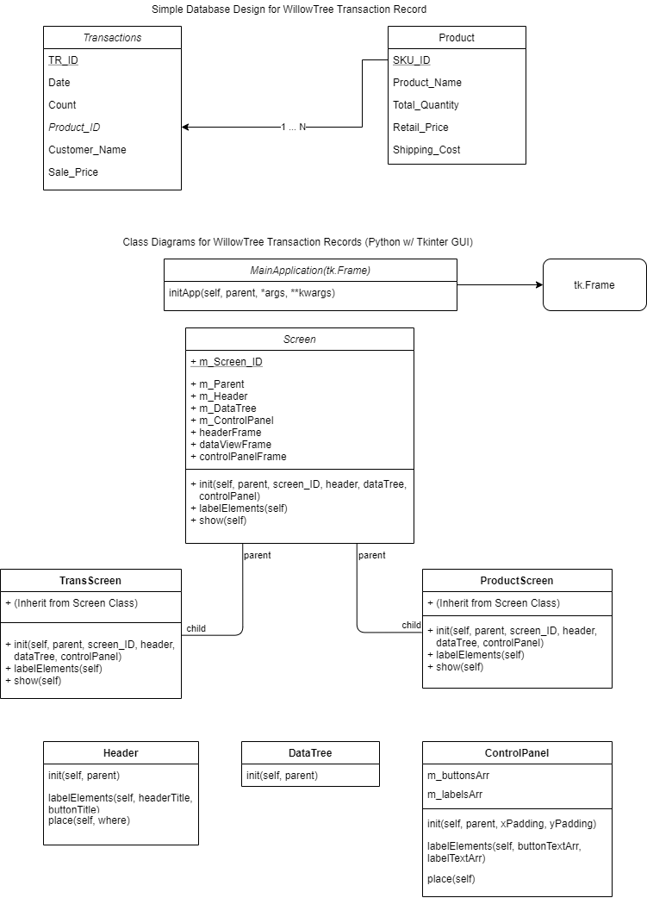

# WillowTreeApp
Purpose: Create an application to log transactions from an online storefront while keeping track of inventory changes from the transactions

**Database Design Overview:**

*Transactions Table*- used for tracking Transaction Line Entries that will populate the TreeView with Tkinter in Python

*Product Table*- used for tracking different types of products a seller may offer, with details such as name and quantity

*Some features are possible through programming such as automatic quantity reduction, for one example

**Class Diagrams for Python Code:**

*MainApplication(tk.Frame):*(inherits from Tkinter.Frame) initializes the tkinter init of the application and first screen accessed

*MainScreen():* A screen consists of a Header, TreeView, and ControlPanel Objects to create multiple GUI Screens displaying, also holding a screen ID to identify through enum's what the screen is

*Header():* Contains title and button to have user identify the current screen

*TreeView():* Will display Data from SQL Transactions query

*ControlPanel():* Contains the Buttons that will add changes to the database

